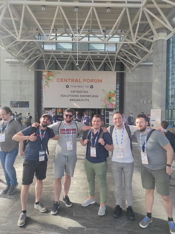
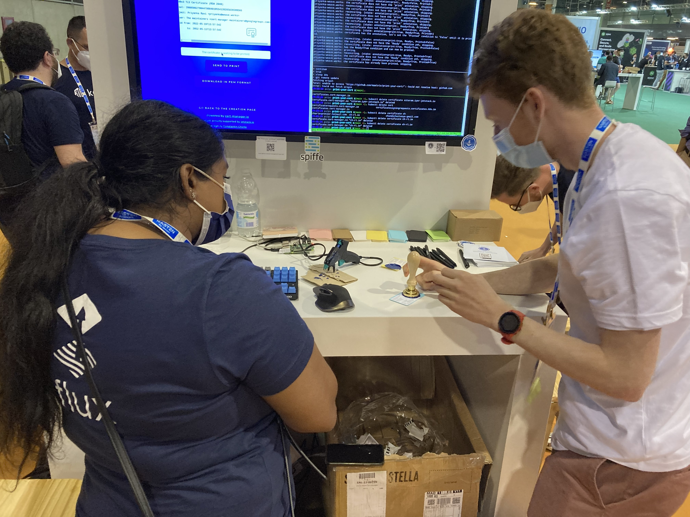
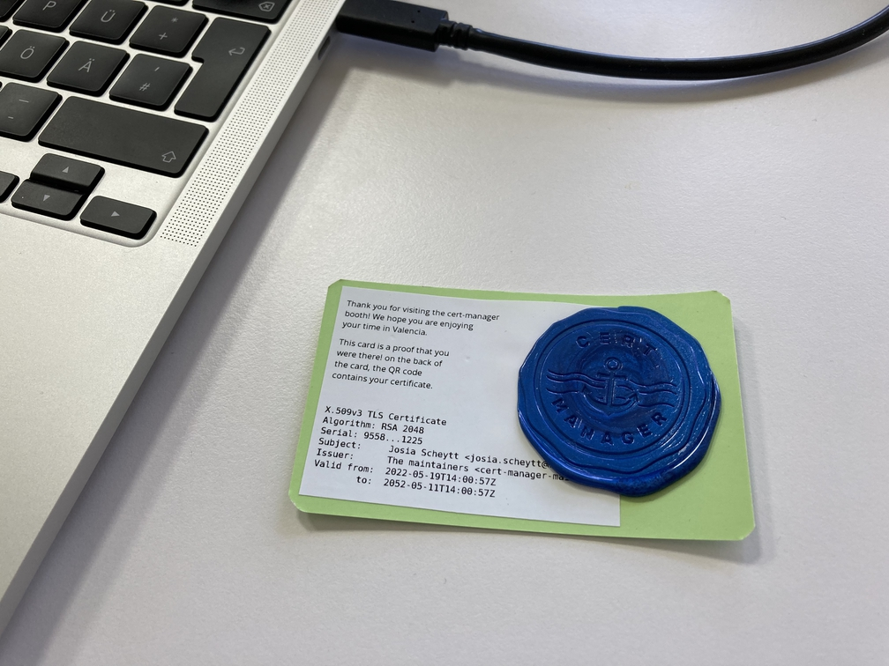

This week I went to KubeCon/CloudNativeCon in Valencia, Spain, together with four of my colleagues, both from mimacom Germany and mimacom Spain.

> Thanks a lot to mimacom for sponsoring our attending!

What I want to talk about in this blog post is not a summary of talks or topics but just how I experienced the whole event.
Is was the first KubeCon I have ever attended, and we came on Monday, left on Friday, so we effectively only attended Tuesday through Thursday (the middle 3 of the 5 days).

## About KubeCon

KubeCon is *the* regular conference for all things Kubernetes and everything happening in the Cloud Native space.
Since the last few years, it has been held 2 times a year, always alternating between Europe and North America.

It is **massive**.
Really massive.
Imagine the biggest fair venue you know of, maybe double that area, and then fill it (and the surrounding city) with more than 6,000 developers - that's how massive it is.

But this mass of people only comes from day 3 to day 5 (Wednesday through Friday).
On the first two days it is *a lot less crowded* because that is the time where the so called "**Co-located Events**" take place.
These are smaller sub-conferences within KubeCon which focus on a specific topic.
Some of these events this time were: Service Mesh Con, Cloud Native Security Con, Kubernetes on Edge Day, and GitOpsCon.
(I think there were about 15 distinct events in total.)

## Disclaimers

To be completely honest up-front, *GitOpsCon was the main reason* I wanted to attend KubeCon at all in the first place, so my view on KubeCon as a whole is biased.

Additionally, I am the type of person who easily gets overwhelmed when staying in very crowded places for longer periods of time.
I can handle it, but not without proper self-care and not very well for multiple days in a row.
This does, admittedly, not put me in a very well-equipped position for a fair like this - just wanted to mention this so you know which color the glasses have through which you now get a view unto this event 😉.

## GitOpsCon

One lesson I have drawn from my first KubeCon is that **the Co-located Events are the real thing**.
That, of course, only applies if there is a Co-located Event in which you have a deep interest 😉.

My heart beats for GitOps and its much wider adoption, so I attended GitOpsCon, which is organized by [OpenGitOps](https://opengitops.dev/) (or the GitOps Working Group (WG), which is sort of the official committee behind it).
GitOpsCon was one of the bigger Co-located Events and even offered multiple talks in parallel during some slots.

One person I was very much looking forward to meeting was Chris Short from AWS EKS (formerly RedHat).
If you have not heard of him before, do check out his newsletter [DevOps'ish](https://devopsish.com/)!
It is one of the three weekly newsletters I regularly read, and I do read very few.

And ... it worked out!
He was holding the first keynote together with Dan Garfield (from Codefresh, ArgoCD maintainer) and Scott Rigby (from Weaveworks, both a Helm and a FluxCD maintainer), and I was able to just walk up to him in the time between two sessions and express my gratitude for his curating that newsletter 🤗!

There were very interesting talks, but sometimes it's funny how the things that stick with you after a talk are not what the talk was actually all about.
I was for instance sitting in a talk by Michael Irwin about creating a platform for campus students to run workloads in Kubernetes, but what the talk really did for me was losing my fair of Helm - simply because of the fast and uncomplicated way he ran `helm create` during a demo in that talk.

What was especially rewarding, engaging, and exciting was getting into conversation with the speakers after their talks.
I am convinced it really makes a huge difference that the barrier to asking is so low when you are together in one room in-person.
Sometimes you can easily get clarifications on unclear points, sometimes you discover together that something is not yet known for both of you, sometimes you discuss about the industry as a whole and in which direction it evolves or should evolve.
One speaker (Andrew Block from RedHat, he talked about Secrets Management with GitOps) even photographed my badge in order to contact me after the event because he could not yet answer a detail question I had!
I am deeply grateful for the opportunity of diving into the community of people in the Cloud Native space.

## New Ideas

Luckily, not only GitOpsCon exposed me to new ideas - that also happened (and happened a lot!) with the talks during the other two days:
I heard about the [Kernel-intercepting eBPF technology](https://kccnceu2022.sched.com/event/ytpE/reproducing-production-issues-in-your-ci-pipeline-using-ebpf-matthew-leray-speedscale-omid-azizi-new-relic), something like "Serverless CloudFoundry" with Knative, and using machine learning to optimize resource requests and limits for SLOs, among many others.
If you want to see which (few) talks I attended, see [my schedule in Sched](https://kccnceu2022.sched.com/jscheytt?iframe=no).

The cool thing with something like Kubernetes and its ecosystem is that you can very quickly **experiment without a big setup investment**.
I e.g. heard about Tekton as a side note and decided to directly give it a go during one of the other talks, and I was directly able to walk through the Getting Started guide to verify how nicely it works!

## Starting To See Patterns

Let me note down a few things I found remarkable and where we as an industry can maybe find better ways of achieving things:

* Not only do we have many tools in the Cloud Native ecosystem (I will not make the next joke about the [CNCF Landscape](https://landscape.cncf.io/), you can invent one yourself 😄), it also seems to me that everybody starts to create another copy-paste version of the [standard Kubernetes Dashboard](https://kubernetes.io/docs/tasks/access-application-cluster/web-ui-dashboard/) but just filtered down to their CRDs.
    * The [Tekton Dashboard](https://github.com/tektoncd/dashboard/blob/main/docs/dashboard-ui.jpg) is a prime example of this, but they are not the only ones who are either actively doing this or considering building their own UI.
    * The Kubernetes Dashboard seems to have a [plugin system](https://github.com/kubernetes/dashboard/blob/master/docs/plugins/README.md), so why don't we all use more of this?
* I have never used ArgoCD because I thought "well, I have learned how to use FluxCD and use it, why should I learn another CD tool?"
    * And like many people, I have been living in a *false dichotomy* that GitOps is *either Flux or Argo* - but that misses the point!
    * [One talk at GitOpsCon](https://gitopsconeu22.sched.com/event/zrqT/implementing-preview-environments-with-gitops-in-kubernetes-francois-le-pape-remazing) showed pretty nicely how you can **use both together**: Use FluxCD as a platform team to deploy your infrastructure, and deploy Argo for your developers to deploy and manage their applications.
    * Just one example: I love Flux, but managing preview environments from PRs is a lot of work (mostly YAML generation), but Argo has a dedicated [Pull Request Generator](https://argocd-applicationset.readthedocs.io/en/stable/Generators-Pull-Request/) to solve this in just about 10 lines of code.

## Meeting Maintainers

If you go to KubeCon only for the talks, you are probably doing it wrong - watch the talks virtually, it is a lot less effort.
There is a whole big area with booths from all kinds of vendors in the Cloud Native space.
One corner of this space is reserved for maintainers of a few Open Source tools.

I especially enjoyed going up to these people and more than anything **thanking them** for the tremendous work they are doing and how grateful I am for getting to work with these tools (almost) every day!
Among these there were especially [FluxCD](https://fluxcd.io/) and [Crossplane](https://crossplane.io/), but also the often overlooked [cert-manager](https://cert-manager.io/).

 

The folks at the cert-manager booth were especially creative in creating an actual SSL certificate for your email address and then printing and even *stamping it with a wax seal*!
Btw do go and check out [their short survey about usage in production clusters](https://docs.google.com/forms/d/e/1FAIpQLSfLX4SQEC0phxVLB2shSzv2s__IDCB6GmlnvsqQ06CD0IYOeA/viewform) to enable them to become a graduated CNCF project.

Some of the tools represented in the maintainers' area were still somewhat new to me.
The great thing was that I could just walk up to them and ask them for a short demo to understand the usage and the difference to other tools.
Special thanks to the folks at the ArgoCD, Backstage, and Buildpacks booths!

## Favorite Quotes

I am going to close with some wise words people have said on this conference:

> If it's not in Git, it's just a rumor.

RedHat printed T-shirts for GitOpsCon with this saying - they were gone quicker than you could queue in at their booth (I did not get one unfortunately ...).

> What is software? Software is code while it is running, code with electricity applied to it.

Justin Garrison in the context of "[Infrastructure as Software](https://gitopsconeu22.sched.com/event/zrr3/infrastructure-as-software-with-gitops-justin-garrison-amazon)" and why GitOps is such a breakthrough for this.

> Kubernetes is the industrial revolution for server computing, that's how fundamental it is.

Lucas Käldström in his talk "[Understanding Kubernetes Through Real-World Penomena](https://kccnceu2022.sched.com/event/ytr4/understanding-kubernetes-through-real-world-phenomena-and-analogies-lucas-kaldstrom)" (very recommended!).
